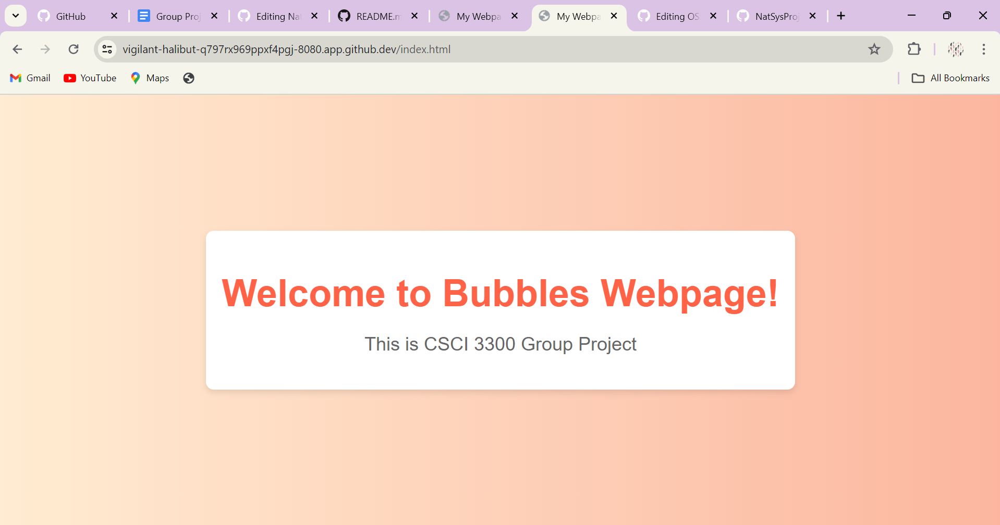

# Net&Sys Assignment: Running Containers for Application Development

Group Name: Bubbles. 

Team Mates:
1. Irdeena Zahierah Binti Zukipeli (2210496)
2. Irdina binti Mohd Azman (2112432)
3. __Fill name__ and __matric no__

## Rules
1. You are allowed to have **3 group** members.
2. When you complete the assignment, make sure to submit the repository link of your cloned project. Make sure all the files are as what you aspect in your repository. 
3. Answer all questions in the **README.md**, in your own repository. Either use the online VSCode, terminal or github to edit. Answers are expected where you see __Fill answer here__.
4. Learn how to use markdown. https://www.w3schools.io/file/markdown-introduction/

## Forking this project repository
1. First thing you need in doing this assignment is to have a github account. Make sure to sign up at https://www.github.com
2. The second thing you need is to fork the Net&Sys Assignment repository in your own github account. 

    1. Go to https://github.com/ZainabBashi/NatSysProject and click fork to copy the project into your own repository
    2. Make sure that the new fork is now in your own repository

***Questions:***

1. What is the link of the fork Net&Sys Assignment in your repository. ***(1 mark)*** __Fill answer here__.
2. How many files and folders are in this repository. ***(1 mark)*** __Fill answer here__.


## Exploring github codespaces

1. The next thing that we will be doing is exploring codespaces. First of all, read about codespaces https://docs.github.com/en/codespaces/overview#what-is-a-codespace
2. Then go to the link https://github.com/codespaces and we shall start a new codespace.  
3. Click on ***New codespace***.
4. Choose your own Net&Sys Assignment repository to start your codespace.

 

5. Once you have created you codespace, you will see the following. You might already be familiar with this, since it will look similar to VSCode. 

 

6. You will see the [README file](./README.md) file. One is a preview of how it looks like on the web, and the other is the editing view in markdown language. 
7. Edit the [README file](./README.md). Make sure you have your group details correct, ie, group name and team members along with their matric Numbers. 
8. Once you have finish editing, click File->Save or ***ctrl-s*** to save it. 
9. After saving, you will notice an M or U next to your file. You will need to commit any changes, whenever you make changes so that it is uploaded to the github repository. 

 

10. Click on the source control, hint: its on the left side panel, and it will list down the files that have been modified or updated. Click on commit. It will then ask you "Would you like to stage all your changes and commit them directly?" Just say yes, and a new tab will appear. Type a message to log what you have done, and click on the check mark. 

 

11. After that, sync the changes to the main repository. 
12. Make sure to commit and sync your files to the main repository, or else, your work will be lost since it is not saved into the main repository when you submit your project.

***Questions:***

1. What is default OS used to run the virtual environment for codespaces. ***(1 mark)*** __Fill answer here__.
   Answer:
   The default OS used to run the virtual environment for codespaces is Ubuntu Linux..
   
3. What are the two options of RAM, disk and vcpu configuration you can have in running codespaces . ***(1 mark)*** __Fill answer here__.
   Answer:
    Option 1: 2-core CPU, 4 GB RAM, and 32 GB storage Option 2: 4-core CPU, 8 GB RAM, and 64 GB storage
   
5. Why must we commit and sync our current work on source control? ***(1 mark)*** __Fill answer here__.
   Answer:
   We must commit and sync our current work on source control because if we don't, our work will be lost since it is not saved 
   into the main repository. Committing and syncing our changes ensures that our work is uploaded to the GitHub repository, 
   making it persistent and accessible even after we close the codespace.

## Exploring the Terminal

1. Look at the TERMINAL tab. Explore and run commands according to the questions below. 
2. You can include your answers as images, or cut and paste the output here. If you are cutting and pasting your answers, wrap your answers in the codeblock clause in markdown. For example, if i run the command **whoami** the the output would look like the one below.
```bash
@joeynor ➜ /workspaces/OSProject (main) $ whoami 
codespace
```


***Questions:***

Look at the TERMINAL tab. Run the following commands and provide the output here. 

1. Run the command **pwd** . ***(1 mark)*** __Fill answer here__.
```bash
@deenazhira ➜ /workspaces/NatSysProject (main) $ pwd
/workspaces/NatSysProject
```
2. Run the command **cat /etc/passwd** . ***(1 mark)*** __Fill answer here__.
```bash
@deenazhira ➜ /workspaces/NatSysProject (main) $ cat /etc/passwd
root:x:0:0:root:/root:/bin/bash
daemon:x:1:1:daemon:/usr/sbin:/usr/sbin/nologin
bin:x:2:2:bin:/bin:/usr/sbin/nologin
sys:x:3:3:sys:/dev:/usr/sbin/nologin
sync:x:4:65534:sync:/bin:/bin/sync
games:x:5:60:games:/usr/games:/usr/sbin/nologin
man:x:6:12:man:/var/cache/man:/usr/sbin/nologin
lp:x:7:7:lp:/var/spool/lpd:/usr/sbin/nologin
mail:x:8:8:mail:/var/mail:/usr/sbin/nologin
news:x:9:9:news:/var/spool/news:/usr/sbin/nologin
uucp:x:10:10:uucp:/var/spool/uucp:/usr/sbin/nologin
proxy:x:13:13:proxy:/bin:/usr/sbin/nologin
www-data:x:33:33:www-data:/var/www:/usr/sbin/nologin
backup:x:34:34:backup:/var/backups:/usr/sbin/nologin
list:x:38:38:Mailing List Manager:/var/list:/usr/sbin/nologin
irc:x:39:39:ircd:/var/run/ircd:/usr/sbin/nologin
gnats:x:41:41:Gnats Bug-Reporting System (admin):/var/lib/gnats:/usr/sbin/nologin
nobody:x:65534:65534:nobody:/nonexistent:/usr/sbin/nologin
_apt:x:100:65534::/nonexistent:/usr/sbin/nologin
systemd-timesync:x:101:101:systemd Time Synchronization,,,:/run/systemd:/usr/sbin/nologin
systemd-network:x:102:103:systemd Network Management,,,:/run/systemd:/usr/sbin/nologin
systemd-resolve:x:103:104:systemd Resolver,,,:/run/systemd:/usr/sbin/nologin
messagebus:x:104:105::/nonexistent:/usr/sbin/nologin
codespace:x:1000:1000::/home/codespace:/bin/bash
sshd:x:105:65534::/run/sshd:/usr/sbin/nologin
```
3. Run the command **df** . ***(1 mark)*** __Fill answer here__.
```bash
@deenazhira ➜ /workspaces/NatSysProject (main) $ df
Filesystem     1K-blocks     Used Available Use% Mounted on
overlay         32847680 10380744  20772836  34% /
tmpfs              65536        0     65536   0% /dev
shm                65536        8     65528   1% /dev/shm
/dev/root       30298176 24408024   5873768  81% /vscode
/dev/loop3      32847680 10380744  20772836  34% /workspaces
/dev/sda1       46127956      100  43752280   1% /tmp
```
4. Run the command **du** . ***(1 mark)*** __Fill answer here__.
```bash
@deenazhira ➜ /workspaces/NatSysProject (main) $ du
4       ./.git/branches
8       ./.git/objects/1b
8       ./.git/objects/83
8       ./.git/objects/47
8       ./.git/objects/71
12      ./.git/objects/62
16      ./.git/objects/58
12      ./.git/objects/73
8       ./.git/objects/a6
8       ./.git/objects/04
8       ./.git/objects/fd
8       ./.git/objects/c1
12      ./.git/objects/e5
8       ./.git/objects/41
8       ./.git/objects/7b
8       ./.git/objects/24
8       ./.git/objects/c6
16      ./.git/objects/3d
8       ./.git/objects/0b
12      ./.git/objects/72
12      ./.git/objects/d2
8       ./.git/objects/86
12      ./.git/objects/1c
8       ./.git/objects/eb
8       ./.git/objects/ab
12      ./.git/objects/ff
16      ./.git/objects/af
8       ./.git/objects/74
8       ./.git/objects/96
12      ./.git/objects/70
8       ./.git/objects/d8
8       ./.git/objects/91
8       ./.git/objects/c3
8       ./.git/objects/3a
12      ./.git/objects/17
12      ./.git/objects/4e
12      ./.git/objects/2e
8       ./.git/objects/0d
8       ./.git/objects/52
8       ./.git/objects/fc
8       ./.git/objects/6a
8       ./.git/objects/e7
16      ./.git/objects/fb
8       ./.git/objects/fa
8       ./.git/objects/4b
12      ./.git/objects/6e
12      ./.git/objects/b5
8       ./.git/objects/49
8       ./.git/objects/60
8       ./.git/objects/fe
8       ./.git/objects/20
8       ./.git/objects/f6
8       ./.git/objects/3f
8       ./.git/objects/a3
8       ./.git/objects/cd
8       ./.git/objects/f2
8       ./.git/objects/b2
8       ./.git/objects/93
8       ./.git/objects/81
8       ./.git/objects/e9
8       ./.git/objects/cb
12      ./.git/objects/64
8       ./.git/objects/b9
8       ./.git/objects/b6
8       ./.git/objects/4f
8       ./.git/objects/4a
4       ./.git/objects/info
12      ./.git/objects/14
1824    ./.git/objects/pack
12      ./.git/objects/44
2464    ./.git/objects
8       ./.git/logs/refs/heads
16      ./.git/logs/refs/remotes/origin
20      ./.git/logs/refs/remotes
32      ./.git/logs/refs
40      ./.git/logs
```
5. Run the command **ls** . ***(1 mark)*** __Fill answer here__.
```bash
@deenazhira ➜ /workspaces/NatSysProject (main) $ ls
README.md  images
```
6. Run the command **ls -asl** . ***(1 mark)*** __Fill answer here__.
```bash
@deenazhira ➜ /workspaces/NatSysProject (main) $ ls -asl
total 36
 4 drwxrwxrwx+ 4 codespace root  4096 Jun 17 14:43 .
 4 drwxr-xrwx+ 5 codespace root  4096 Jun 17 14:43 ..
 4 drwxrwxrwx+ 9 codespace root  4096 Jun 17 15:49 .git
20 -rw-rw-rw-  1 codespace root 19979 Jun 17 15:55 README.md
 4 drwxrwxrwx+ 2 codespace root  4096 Jun 17 14:43 images
```
7. Run the command **free -h** . ***(1 mark)*** __Fill answer here__.
```bash
@deenazhira ➜ /workspaces/NatSysProject (main) $ free -h
              total        used        free      shared  buff/cache   available
Mem:          7.7Gi       1.4Gi       337Mi        67Mi       6.0Gi       6.0Gi
Swap:            0B          0B          0B
```
8. Run the command **cat /proc/cpuinfo** . ***(1 mark)*** __Fill answer here__.
```bash
@deenazhira ➜ /workspaces/NatSysProject (main) $ cat /proc/cpuinfo
processor       : 0
vendor_id       : AuthenticAMD
cpu family      : 25
model           : 1
model name      : AMD EPYC 7763 64-Core Processor
stepping        : 1
microcode       : 0xffffffff
cpu MHz         : 3025.194
cache size      : 512 KB
physical id     : 0
siblings        : 2
core id         : 0
cpu cores       : 1
apicid          : 0
initial apicid  : 0
fpu             : yes
fpu_exception   : yes
cpuid level     : 13
wp              : yes
flags           : fpu vme de pse tsc msr pae mce cx8 apic sep mtrr pge mca cmov pat pse36 clflush mmx fxsr sse sse2 ht syscall nx mmxext fxsr_opt pdpe1gb rdtscp lm constant_tsc rep_good nopl tsc_reliable nonstop_tsc cpuid extd_apicid aperfmperf pni pclmulqdq ssse3 fma cx16 pcid sse4_1 sse4_2 movbe popcnt aes xsave avx f16c rdrand hypervisor lahf_lm cmp_legacy svm cr8_legacy abm sse4a misalignsse 3dnowprefetch osvw topoext invpcid_single vmmcall fsgsbase bmi1 avx2 smep bmi2 erms invpcid rdseed adx smap clflushopt clwb sha_ni xsaveopt xsavec xgetbv1 xsaves clzero xsaveerptr rdpru arat npt nrip_save tsc_scale vmcb_clean flushbyasid decodeassists pausefilter pfthreshold v_vmsave_vmload umip vaes vpclmulqdq rdpid fsrm
bugs            : sysret_ss_attrs null_seg spectre_v1 spectre_v2 spec_store_bypass srso
bogomips        : 4890.85
TLB size        : 2560 4K pages
clflush size    : 64
cache_alignment : 64
address sizes   : 48 bits physical, 48 bits virtual
power management:

processor       : 1
vendor_id       : AuthenticAMD
cpu family      : 25
model           : 1
model name      : AMD EPYC 7763 64-Core Processor
stepping        : 1
microcode       : 0xffffffff
cpu MHz         : 3127.436
cache size      : 512 KB
physical id     : 0
siblings        : 2
core id         : 0
cpu cores       : 1
apicid          : 1
initial apicid  : 1
fpu             : yes
fpu_exception   : yes
cpuid level     : 13
wp              : yes
flags           : fpu vme de pse tsc msr pae mce cx8 apic sep mtrr pge mca cmov pat pse36 clflush mmx fxsr sse sse2 ht syscall nx mmxext fxsr_opt pdpe1gb rdtscp lm constant_tsc rep_good nopl tsc_reliable nonstop_tsc cpuid extd_apicid aperfmperf pni pclmulqdq ssse3 fma cx16 pcid sse4_1 sse4_2 movbe popcnt aes xsave avx f16c rdrand hypervisor lahf_lm cmp_legacy svm cr8_legacy abm sse4a misalignsse 3dnowprefetch osvw topoext invpcid_single vmmcall fsgsbase bmi1 avx2 smep bmi2 erms invpcid rdseed adx smap clflushopt clwb sha_ni xsaveopt xsavec xgetbv1 xsaves clzero xsaveerptr rdpru arat npt nrip_save tsc_scale vmcb_clean flushbyasid decodeassists pausefilter pfthreshold v_vmsave_vmload umip vaes vpclmulqdq rdpid fsrm
bugs            : sysret_ss_attrs null_seg spectre_v1 spectre_v2 spec_store_bypass srso
bogomips        : 4890.85
TLB size        : 2560 4K pages
clflush size    : 64
cache_alignment : 64
address sizes   : 48 bits physical, 48 bits virtual
power management:
```
9. Run the command **top** and type **q** to quit. ***(1 mark)*** __Fill answer here__.
```bash
top - 15:04:39 up 23 min,  0 users,  load average: 0.07, 0.22, 0.39
Tasks:  17 total,   1 running,  16 sleeping,   0 stopped,   0 zombie
%Cpu(s):  4.0 us,  4.2 sy,  0.0 ni, 91.6 id,  0.2 wa,  0.0 hi,  0.0 si,  0.0 st
MiB Mem :   7929.6 total,    254.5 free,   1339.9 used,   6335.2 buff/cache
MiB Swap:      0.0 total,      0.0 free,      0.0 used.   6207.9 avail Mem 

    PID USER      PR  NI    VIRT    RES    SHR S  %CPU  %MEM     TIME+ COMMAND                                                           
   2625 codespa+  20   0 1117764  63872  42112 S   1.3   0.8   0:01.69 node                                                              
   2084 codespa+  20   0   21.5g 333116  49920 S   1.0   4.1   0:22.93 node                                                              
      1 codespa+  20   0    1136    640    640 S   0.0   0.0   0:00.04 docker-init                                                       
      7 codespa+  20   0    7236   1792   1792 S   0.0   0.0   0:00.01 sleep                                                             
     49 root      20   0   12196   3608   2688 S   0.0   0.0   0:00.00 sshd                                                              
   1238 codespa+  20   0    2616   1408   1408 S   0.0   0.0   0:00.01 sh                                                                
   1268 root      20   0    2616   1536   1536 S   0.0   0.0   0:00.00 sh                                                                
   1999 codespa+  20   0    2624   1664   1664 S   0.0   0.0   0:00.01 sh                                                                
   2007 codespa+  20   0 1330508 105300  45440 S   0.0   1.3   0:05.47 node                                                              
   2176 codespa+  20   0 1240308  52496  41344 S   0.0   0.6   0:00.26 node                                                              
   3213 codespa+  20   0 1016148  78936  40832 S   0.0   1.0   0:00.84 node                                                              
   3737 codespa+  20   0    2616   1536   1536 S   0.0   0.0   0:00.00 sh                                                                
   3781 root      20   0    2616   1408   1408 S   0.0   0.0   0:00.00 sh                                                                
   4001 root      20   0 1983176  82028  51968 S   0.0   1.0   0:00.29 dockerd                                                           
   4008 root      20   0 1798832  41656  30080 S   0.0   0.5   0:00.39 containerd                                                        
   4208 codespa+  20   0   16628  11520   3456 S   0.0   0.1   0:00.14 bash                                                              
  12562 codespa+  20   0   10888   3456   3072 R   0.0   0.0   0:00.00 top    
```
10. Run the command **uname -a**. ***(1 mark)*** __Fill answer here__.
```bash
@deenazhira ➜ /workspaces/NatSysProject (main) $ uname -a
Linux codespaces-71f930 6.5.0-1021-azure #22~22.04.1-Ubuntu SMP Tue Apr 30 16:08:18 UTC 2024 x86_64 x86_64 x86_64 GNU/Linux
```
11. What is the available free memory in the system. ***(1 mark)*** __Fill answer here__.
```bash
6.0Gi
```
12. What is the available disk space mounted on /workspace. ***(1 mark)*** __Fill answer here__.
```bash
20772836
```
13. Name the version and hardware architecture of the linux Virtual environment. ***(1 mark)*** __Fill answer here__.
```bash
Version : 6.5.0-1021-azure , Hardware : x86_64
```
14. What is the difference between **ls** vs **ls -asl**. ***(1 mark)*** __Fill answer here__.
```bash
The ls command in Unix-like operating systems lists directory contents. The ls -asl  command combines several options that modify the output.
```
15. What is the TLB size of the Virtual CPU. ***(1 mark)*** __Fill answer here__.
```bash
TLB size        : 2560 4K pages
```
16. What is the CPU speed of the Virtual CPU. ***(1 mark)*** __Fill answer here__.
```bash
cpu MHz         : 3127.436
```
17. What is the top running process that consumes the most CPU cycles. ***(1 mark)*** __Fill answer here__.
```bash
2625
```

## Running your own container instance.

1. At the terminal, run a linux instance. By typing the following command. 
```
docker pull debian
docker run --detach -it debian
```
```bash
@deenazhira ➜ /workspaces/NatSysProject (main) $ docker pull debian
Using default tag: latest
latest: Pulling from library/debian
fea1432adf09: Pull complete 
Digest: sha256:a92ed51e0996d8e9de041ca05ce623d2c491444df6a535a566dabd5cb8336946
Status: Downloaded newer image for debian:latest
docker.io/library/debian:latest
```
2. This will run the debian container. To check if the debian container is running, type
```bash
@joeynor ➜ /workspaces/OSProject (main) $ docker ps -a
CONTAINER ID   IMAGE     COMMAND   CREATED         STATUS         PORTS     NAMES
f65be1987f84   debian    "bash"    4 minutes ago   Up 4 minutes             romantic_jackson
```
```bash
@deenazhira ➜ /workspaces/NatSysProject (main) $ docker ps -a
CONTAINER ID   IMAGE     COMMAND   CREATED          STATUS          PORTS     NAMES
b274536834ff   debian    "bash"    17 seconds ago   Up 15 seconds             sharp_hodgkin
```

3. Keep note of the name used by your container, this is usually given random names unless you specify your own name. Now run a bash command on the container. Make sure you use the name of your container instead of the one shown here. 
```bash
docker exec -i -t romantic_jackson /bin/bash
```
```bash
@deenazhira ➜ /workspaces/NatSysProject (main) $ docker exec -i -t sharp_hodgkin /bin/bash
```

4. Create a file on the container. First you must make sure you are in the bash command prompt of the container. The container is new, and does not have any software other than the debian OS. To create a new file, you will need an editor installed. In the bash shell of the container, run the package manager apt-get to install nano text editor. 

```bash
root@f65be1987f84:~# apt-get update      

root@f65be1987f84:~# apt-get install nano

root@f65be1987f84:~# cd /root

root@f65be1987f84:~# nano helloworld.txt
```

5. Edit your helloworld.txt, create your messsage and save by typing ctrl-X. Once saved, explore using the container to see where the file is located. Then exit the shell, by typing **exit**.

6. Stop the container and run **docker ps -a**, and restart the container again. Is your file in the container still available?
```bash 
@joeynor ➜ /workspaces/OSProject (main) $ docker stop romantic_jackson

@joeynor ➜ /workspaces/OSProject (main) $ docker ps -a
CONTAINER ID   IMAGE     COMMAND   CREATED          STATUS                        PORTS     NAMES
f65be1987f84   debian    "bash"    19 minutes ago   Exited (137) 18 seconds ago             romantic_jackson

@joeynor ➜ /workspaces/OSProject (main) $ docker restart romantic_jackson
```
```bash 
@deenazhira ➜ /workspaces/NatSysProject (main) $ docker stop sharp_hodgkin
sharp_hodgkin
@deenazhira ➜ /workspaces/NatSysProject (main) $ docker ps -a
CONTAINER ID   IMAGE     COMMAND   CREATED          STATUS                       PORTS     NAMES
b274536834ff   debian    "bash"    10 minutes ago   Exited (137) 8 seconds ago             sharp_hodgkin
@deenazhira ➜ /workspaces/NatSysProject (main) $ docker restart sharp_hodgkin
sharp_hodgkin
```

7. Stop the container and delete the container. What happened to your helloworld.txt?

```bash 
@joeynor ➜ /workspaces/OSProject (main) $ docker stop romantic_jackson

@joeynor ➜ /workspaces/OSProject (main) $ docker ps -a
CONTAINER ID   IMAGE     COMMAND   CREATED          STATUS                        PORTS     NAMES
f65be1987f84   debian    "bash"    19 minutes ago   Exited (137) 18 seconds ago             romantic_jackson

@joeynor ➜ /workspaces/OSProject (main) $ docker rm romantic_jackson
```
```bash 
@deenazhira ➜ /workspaces/NatSysProject (main) $ docker stop sharp_hodgkin
sharp_hodgkin
@deenazhira ➜ /workspaces/NatSysProject (main) $ docker ps -a
CONTAINER ID   IMAGE     COMMAND   CREATED          STATUS                       PORTS     NAMES
b274536834ff   debian    "bash"    13 minutes ago   Exited (137) 7 seconds ago             sharp_hodgkin
@deenazhira ➜ /workspaces/NatSysProject (main) $ docker rm sharp_hodgkin
sharp_hodgkin
```

***Questions:***

1. Are files in the container persistent. Why not?. ***(1 mark)*** __Fill answer here__.
No, files created inside the container's file system are not persistent once the container is deleted. This is because Docker containers are designed to be ephemeral by nature. When you stop and remove a container, its file system is also removed unless you explicitly save or mount volumes to persist data.
2. Can we run two, or three instances of debian linux? . ***(1 mark)*** __Fill answer here__.
Yes, can run multiple instances of Debian Linux using Docker. Each instance will be a separate container and can run independently of others.
## Running your own container with persistent storage

1. In the previous experiment, you might have notice that containers are not persistent. To make storage persistent, you will need to mount them. 
At the terminal, create a new directory called **myroot**, and run a instance of debian linux and mount myroot to the container. Find out the exact path of my root, and mount it as the root folder in the debian container. 
2. Create a file in /root on the container, the files should also appear in myroot of your host VM.

```bash 
@joeynor ➜ /workspaces/OSProject (main) $ mkdir myroot
@joeynor ➜ /workspaces/OSProject (main) $ cd myroot/
@joeynor ➜ /workspaces/OSProject/myroot (main) $ pwd
/workspaces/OSProject/myroot

@joeynor ➜ /workspaces/OSProject/myroot (main) $ docker run --detach -it -v /workspaces/OSProject/myroot:/root debian
```

***Questions:***

1. Check the permission of the files created in myroot, what user and group is the files created in docker container on the host virtual machine? . ***(2 mark)*** __Fill answer here__.
```bash 
The user and group of the files created in the Docker container on the host VM will be root by default. This is because the container runs with root privileges unless otherwise specified.
@deenazhira ➜ /workspaces/NatSysProject/myroot (main) $ ls -l /workspaces/NatSysProject/myroot
total 4
-rw-rw-rw- 1 root root 14 Jun 17 19:16 helloworld.txtd
```
2. Can you change the permission of the files to user codespace.  You will need this to be able to commit and get points for this question. ***(2 mark)***
```bash
//use sudo and chown
sudo chown -R codespace:codespace myroot

```
```bash
Yes can change
@deenazhira ➜ /workspaces/NatSysProject/myroot (main) $ sudo chown -R codespace:codespace /workspaces/NatSysProject/myroot
@deenazhira ➜ /workspaces/NatSysProject/myroot (main) $ ls -l /workspaces/NatSysProject/myroot
total 4
-rw-rw-rw- 1 codespace codespace 14 Jun 17 19:16 helloworld.txt
```
*** __Fill answer here__.***

## You are on your own, create your own static webpage

1. Create a directory called webpage in your host machine
2. Inside the directory, create a page index.html, with any content you would like
3. Then, run the apache webserver and mount the webpage directory to it. Hint:
```bash
## the -p 8080:80 flag points the host port 8080 to the container port 80

docker run --detach -v /workspaces/OSProject/webpage:/usr/local/apache2/htdocs/ -p 8080:80 httpd
```

4. If it works, codespace will trigger a port assignment and provide a URL for you to access your webpage like the one below.

 


5. You can also see the Port in the **PORTS** tab, next to the terminal tab.

6. You can then access your website by adding an index.html towards the end of your url link, like the one below. 

 
 
 

***Questions:***

1. What is the permission of folder /usr/local/apache/htdocs and what user and group owns the folder? . ***(2 mark)*** __Fill answer here__.
```bash
Permission : drwxrwxrwx+
user and group : root 
@deenazhira ➜ /workspaces/NatSysProject/webpage (main) $ docker exec -it naughty_ritchie /bin/bash
root@e8dbaebf3bda:/usr/local/apache2# ls -ld /usr/local/apache2/htdocs
drwxrwxrwx+ 2 1000 1000 4096 Jun 18 06:19 /usr/local/apache2/htdocs
```
2. What port is the apache web server running. ***(1 mark)***
```bash
@deenazhira ➜ /workspaces/NatSysProject/webpage (main) $ docker ps
CONTAINER ID   IMAGE     COMMAND              CREATED         STATUS         PORTS                                   NAMES
e8dbaebf3bda   httpd     "httpd-foreground"   7 minutes ago   Up 7 minutes   0.0.0.0:8080->80/tcp, :::8080->80/tcp   naughty_ritchie
Apache web server port : 80 
```
3. What port is open for http protocol on the host machine? ***(1 mark)***
```bash
Host Machine HTTP Port : 8080
```

## Create SUB Networks

1. In docker, you can create your own private networks where you can run multiple services, in this part, we will create two networks, one called bluenet and the other is rednet
2. Run the docker create network to create you networks like the ones below
```bash
## STEP 1:
## Create Networks ##
docker network create bluenet
docker network create rednet`

## STEP 2: (automatically running)
## Create (1) Container in background called "c1" running busybox image ##
docker run -itd --net bluenet --name c1 busybox sh
docker run -itd --net rednet --name c2 busybox sh
```
***Questions:***

1. Describe what is busybox and what is command switch **--name** is for? . ***(2 mark)*** __Fill answer here__.
   Answer: BusyBox is a lightweight, multi-tool executable that combines many common Unix utilities into a single executable file. The --name command switch is used to specify the name of the BusyBox executable.
   
3. Explore the network using the command ```docker network ls```, show the output of your terminal. ***(1 mark)***
```bash
@deenazhira ➜ /workspaces/NatSysProject/webpage (main) $ docker network ls
NETWORK ID     NAME      DRIVER    SCOPE
9c6186d15728   bluenet   bridge    local
604c4e1e2b15   bridge    bridge    local
980180301b55   host      host      local
38c6383657a3   none      null      local
b0917c7a0c85   rednet    bridge    local
```
3. Using ```docker inspect c1``` and ```docker inspect c2``` inscpect the two network. What is the gateway of bluenet and rednet.? ***(1 mark)***
```bash
@deenazhira ➜ /workspaces/NatSysProject/webpage (main) $ docker inspect c1
[
    {
        "Id": "d6e59cbea8084091984b4308872e2d14ca608b0a75a30dd59cbf2ec1193886cc",
        "Created": "2024-06-18T06:35:30.495390943Z",
        "Path": "sh",
        "Args": [],
        "State": {
            "Status": "running",
            "Running": true,
            "Paused": false,
            "Restarting": false,
            "OOMKilled": false,
            "Dead": false,
            "Pid": 16290,
            "ExitCode": 0,
            "Error": "",
            "StartedAt": "2024-06-18T06:35:31.032737603Z",
            "FinishedAt": "0001-01-01T00:00:00Z"
        },
        "Image": "sha256:65ad0d468eb1c558bf7f4e64e790f586e9eda649ee9f130cd0e835b292bbc5ac",
        "ResolvConfPath": "/var/lib/docker/containers/d6e59cbea8084091984b4308872e2d14ca608b0a75a30dd59cbf2ec1193886cc/resolv.conf",
        "HostnamePath": "/var/lib/docker/containers/d6e59cbea8084091984b4308872e2d14ca608b0a75a30dd59cbf2ec1193886cc/hostname",
        "HostsPath": "/var/lib/docker/containers/d6e59cbea8084091984b4308872e2d14ca608b0a75a30dd59cbf2ec1193886cc/hosts",
        "LogPath": "/var/lib/docker/containers/d6e59cbea8084091984b4308872e2d14ca608b0a75a30dd59cbf2ec1193886cc/d6e59cbea8084091984b4308872e2d14ca608b0a75a30dd59cbf2ec1193886cc-json.log",
        "Name": "/c1",
        "RestartCount": 0,
        "Driver": "overlay2",
        "Platform": "linux",
        "MountLabel": "",
        "ProcessLabel": "",
        "AppArmorProfile": "docker-default",
        "ExecIDs": null,
        "HostConfig": {
            "Binds": null,
            "ContainerIDFile": "",
            "LogConfig": {
                "Type": "json-file",
                "Config": {}
            },
            "NetworkMode": "bluenet",
            "PortBindings": {},
            "RestartPolicy": {
                "Name": "no",
                "MaximumRetryCount": 0
            },
            "AutoRemove": false,
            "VolumeDriver": "",
            "VolumesFrom": null,
            "ConsoleSize": [
                11,
                139
            ],
            "CapAdd": null,
            "CapDrop": null,
            "CgroupnsMode": "private",
            "Dns": [],
            "DnsOptions": [],
            "DnsSearch": [],
            "ExtraHosts": null,
            "GroupAdd": null,
            "IpcMode": "private",
            "Cgroup": "",
            "Links": null,
            "OomScoreAdj": 0,
            "PidMode": "",
            "Privileged": false,
            "PublishAllPorts": false,
            "ReadonlyRootfs": false,
            "SecurityOpt": null,
            "UTSMode": "",
            "UsernsMode": "",
            "ShmSize": 67108864,
            "Runtime": "runc",
            "Isolation": "",
            "CpuShares": 0,
            "Memory": 0,
            "NanoCpus": 0,
            "CgroupParent": "",
            "BlkioWeight": 0,
            "BlkioWeightDevice": [],
            "BlkioDeviceReadBps": [],
            "BlkioDeviceWriteBps": [],
            "BlkioDeviceReadIOps": [],
            "BlkioDeviceWriteIOps": [],
            "CpuPeriod": 0,
            "CpuQuota": 0,
            "CpuRealtimePeriod": 0,
            "CpuRealtimeRuntime": 0,
            "CpusetCpus": "",
            "CpusetMems": "",
            "Devices": [],
            "DeviceCgroupRules": null,
            "DeviceRequests": null,
            "MemoryReservation": 0,
            "MemorySwap": 0,
            "MemorySwappiness": null,
            "OomKillDisable": null,
            "PidsLimit": null,
            "Ulimits": [],
            "CpuCount": 0,
            "CpuPercent": 0,
            "IOMaximumIOps": 0,
            "IOMaximumBandwidth": 0,
            "MaskedPaths": [
                "/proc/asound",
                "/proc/acpi",
                "/proc/kcore",
                "/proc/keys",
                "/proc/latency_stats",
                "/proc/timer_list",
                "/proc/timer_stats",
                "/proc/sched_debug",
                "/proc/scsi",
                "/sys/firmware",
                "/sys/devices/virtual/powercap"
            ],
            "ReadonlyPaths": [
                "/proc/bus",
                "/proc/fs",
                "/proc/irq",
                "/proc/sys",
                "/proc/sysrq-trigger"
            ]
        },
        "GraphDriver": {
            "Data": {
                "LowerDir": "/var/lib/docker/overlay2/93d02d29a5b86f7db135b34d5899a24a330881ca6c2ab47f38fd04c0a3729e14-init/diff:/var/lib/docker/overlay2/d11ef338afb8567a8abaa0063a1cb2edffd7105331ffe4c7a47b844edf616bdb/diff",
                "MergedDir": "/var/lib/docker/overlay2/93d02d29a5b86f7db135b34d5899a24a330881ca6c2ab47f38fd04c0a3729e14/merged",
                "UpperDir": "/var/lib/docker/overlay2/93d02d29a5b86f7db135b34d5899a24a330881ca6c2ab47f38fd04c0a3729e14/diff",
                "WorkDir": "/var/lib/docker/overlay2/93d02d29a5b86f7db135b34d5899a24a330881ca6c2ab47f38fd04c0a3729e14/work"
            },
            "Name": "overlay2"
        },
        "Mounts": [],
        "Config": {
            "Hostname": "d6e59cbea808",
            "Domainname": "",
            "User": "",
            "AttachStdin": false,
            "AttachStdout": false,
            "AttachStderr": false,
            "Tty": true,
            "OpenStdin": true,
            "StdinOnce": false,
            "Env": null,
            "Cmd": [
                "sh"
            ],
            "Image": "busybox",
            "Volumes": null,
            "WorkingDir": "",
            "Entrypoint": null,
            "OnBuild": null,
            "Labels": {}
        },
        "NetworkSettings": {
            "Bridge": "",
            "SandboxID": "2df22ed4e9987596f4cd2193c409d1b53ef64fb8b2888ebb67718efb54952a09",
            "SandboxKey": "/var/run/docker/netns/2df22ed4e998",
            "Ports": {},
            "HairpinMode": false,
            "LinkLocalIPv6Address": "",
            "LinkLocalIPv6PrefixLen": 0,
            "SecondaryIPAddresses": null,
            "SecondaryIPv6Addresses": null,
            "EndpointID": "",
            "Gateway": "",
            "GlobalIPv6Address": "",
            "GlobalIPv6PrefixLen": 0,
            "IPAddress": "",
            "IPPrefixLen": 0,
            "IPv6Gateway": "",
            "MacAddress": "",
            "Networks": {
                "bluenet": {
                    "IPAMConfig": null,
                    "Links": null,
                    "Aliases": null,
                    "MacAddress": "02:42:ac:12:00:02",
                    "NetworkID": "9c6186d157283333baf3bff339fc943fb7eb3261fbfadeb0f60f274af8f4df5e",
                    "EndpointID": "64c3c04bc42f0424c8078725b85c25030a59edca18c53b2f655db9c153c91e4d",
                    "Gateway": "172.18.0.1",
                    "IPAddress": "172.18.0.2",
                    "IPPrefixLen": 16,
                    "IPv6Gateway": "",
                    "GlobalIPv6Address": "",
                    "GlobalIPv6PrefixLen": 0,
                    "DriverOpts": null,
                    "DNSNames": [
                        "c1",
                        "d6e59cbea808"
                    ]
                }
            }
        }
    }
]
```
```bash
@deenazhira ➜ /workspaces/NatSysProject/webpage (main) $ docker inspect c2
[
    {
        "Id": "032ac70b9123722cce7c4d6d084166fa505d029b24a3a89c7c8f2d8367330597",
        "Created": "2024-06-18T06:35:52.678318771Z",
        "Path": "sh",
        "Args": [],
        "State": {
            "Status": "running",
            "Running": true,
            "Paused": false,
            "Restarting": false,
            "OOMKilled": false,
            "Dead": false,
            "Pid": 16598,
            "ExitCode": 0,
            "Error": "",
            "StartedAt": "2024-06-18T06:35:53.222148431Z",
            "FinishedAt": "0001-01-01T00:00:00Z"
        },
        "Image": "sha256:65ad0d468eb1c558bf7f4e64e790f586e9eda649ee9f130cd0e835b292bbc5ac",
        "ResolvConfPath": "/var/lib/docker/containers/032ac70b9123722cce7c4d6d084166fa505d029b24a3a89c7c8f2d8367330597/resolv.conf",
        "HostnamePath": "/var/lib/docker/containers/032ac70b9123722cce7c4d6d084166fa505d029b24a3a89c7c8f2d8367330597/hostname",
        "HostsPath": "/var/lib/docker/containers/032ac70b9123722cce7c4d6d084166fa505d029b24a3a89c7c8f2d8367330597/hosts",
        "LogPath": "/var/lib/docker/containers/032ac70b9123722cce7c4d6d084166fa505d029b24a3a89c7c8f2d8367330597/032ac70b9123722cce7c4d6d084166fa505d029b24a3a89c7c8f2d8367330597-json.log",
        "Name": "/c2",
        "RestartCount": 0,
        "Driver": "overlay2",
        "Platform": "linux",
        "MountLabel": "",
        "ProcessLabel": "",
        "AppArmorProfile": "docker-default",
        "ExecIDs": null,
        "HostConfig": {
            "Binds": null,
            "ContainerIDFile": "",
            "LogConfig": {
                "Type": "json-file",
                "Config": {}
            },
            "NetworkMode": "rednet",
            "PortBindings": {},
            "RestartPolicy": {
                "Name": "no",
                "MaximumRetryCount": 0
            },
            "AutoRemove": false,
            "VolumeDriver": "",
            "VolumesFrom": null,
            "ConsoleSize": [
                11,
                139
            ],
            "CapAdd": null,
            "CapDrop": null,
            "CgroupnsMode": "private",
            "Dns": [],
            "DnsOptions": [],
            "DnsSearch": [],
            "ExtraHosts": null,
            "GroupAdd": null,
            "IpcMode": "private",
            "Cgroup": "",
            "Links": null,
            "OomScoreAdj": 0,
            "PidMode": "",
            "Privileged": false,
            "PublishAllPorts": false,
            "ReadonlyRootfs": false,
            "SecurityOpt": null,
            "UTSMode": "",
            "UsernsMode": "",
            "ShmSize": 67108864,
            "Runtime": "runc",
            "Isolation": "",
            "CpuShares": 0,
            "Memory": 0,
            "NanoCpus": 0,
            "CgroupParent": "",
            "BlkioWeight": 0,
            "BlkioWeightDevice": [],
            "BlkioDeviceReadBps": [],
            "BlkioDeviceWriteBps": [],
            "BlkioDeviceReadIOps": [],
            "BlkioDeviceWriteIOps": [],
            "CpuPeriod": 0,
            "CpuQuota": 0,
            "CpuRealtimePeriod": 0,
            "CpuRealtimeRuntime": 0,
            "CpusetCpus": "",
            "CpusetMems": "",
            "Devices": [],
            "DeviceCgroupRules": null,
            "DeviceRequests": null,
            "MemoryReservation": 0,
            "MemorySwap": 0,
            "MemorySwappiness": null,
            "OomKillDisable": null,
            "PidsLimit": null,
            "Ulimits": [],
            "CpuCount": 0,
            "CpuPercent": 0,
            "IOMaximumIOps": 0,
            "IOMaximumBandwidth": 0,
            "MaskedPaths": [
                "/proc/asound",
                "/proc/acpi",
                "/proc/kcore",
                "/proc/keys",
                "/proc/latency_stats",
                "/proc/timer_list",
                "/proc/timer_stats",
                "/proc/sched_debug",
                "/proc/scsi",
                "/sys/firmware",
                "/sys/devices/virtual/powercap"
            ],
            "ReadonlyPaths": [
                "/proc/bus",
                "/proc/fs",
                "/proc/irq",
                "/proc/sys",
                "/proc/sysrq-trigger"
            ]
        },
        "GraphDriver": {
            "Data": {
                "LowerDir": "/var/lib/docker/overlay2/2ecc55a425d5c980df85e6bf7ae56ba9bbcce0c92134b489f7889c53ccab9b2e-init/diff:/var/lib/docker/overlay2/d11ef338afb8567a8abaa0063a1cb2edffd7105331ffe4c7a47b844edf616bdb/diff",
                "MergedDir": "/var/lib/docker/overlay2/2ecc55a425d5c980df85e6bf7ae56ba9bbcce0c92134b489f7889c53ccab9b2e/merged",
                "UpperDir": "/var/lib/docker/overlay2/2ecc55a425d5c980df85e6bf7ae56ba9bbcce0c92134b489f7889c53ccab9b2e/diff",
                "WorkDir": "/var/lib/docker/overlay2/2ecc55a425d5c980df85e6bf7ae56ba9bbcce0c92134b489f7889c53ccab9b2e/work"
            },
            "Name": "overlay2"
        },
        "Mounts": [],
        "Config": {
            "Hostname": "032ac70b9123",
            "Domainname": "",
            "User": "",
            "AttachStdin": false,
            "AttachStdout": false,
            "AttachStderr": false,
            "Tty": true,
            "OpenStdin": true,
            "StdinOnce": false,
            "Env": null,
            "Cmd": [
                "sh"
            ],
            "Image": "busybox",
            "Volumes": null,
            "WorkingDir": "",
            "Entrypoint": null,
            "OnBuild": null,
            "Labels": {}
        },
        "NetworkSettings": {
            "Bridge": "",
            "SandboxID": "a76f989d92d6614a6c6ac854b91010c57b4267a111694b987f9fd205a776c741",
            "SandboxKey": "/var/run/docker/netns/a76f989d92d6",
            "Ports": {},
            "HairpinMode": false,
            "LinkLocalIPv6Address": "",
            "LinkLocalIPv6PrefixLen": 0,
            "SecondaryIPAddresses": null,
            "SecondaryIPv6Addresses": null,
            "EndpointID": "",
            "Gateway": "",
            "GlobalIPv6Address": "",
            "GlobalIPv6PrefixLen": 0,
            "IPAddress": "",
            "IPPrefixLen": 0,
            "IPv6Gateway": "",
            "MacAddress": "",
            "Networks": {
                "rednet": {
                    "IPAMConfig": null,
                    "Links": null,
                    "Aliases": null,
                    "MacAddress": "02:42:ac:13:00:02",
                    "NetworkID": "b0917c7a0c858f932e505d1282683d01d76146ba5bb3b4f90d0f752f5905d21f",
                    "EndpointID": "8d04f7a0d0a60d3160c61301a4e641169d378bf85935cdd1f6acadb09dab024a",
                    "Gateway": "172.19.0.1",
                    "IPAddress": "172.19.0.2",
                    "IPPrefixLen": 16,
                    "IPv6Gateway": "",
                    "GlobalIPv6Address": "",
                    "GlobalIPv6PrefixLen": 0,
                    "DriverOpts": null,
                    "DNSNames": [
                        "c2",
                        "032ac70b9123"
                    ]
                }
            }
        }
    }
]
```
```bash
Gateway bluenet : 172.18.0.1
Gateway rednet : 172.19.0.1
```
4. What is the network address for the running container c1 and c2.
```bash
IPAddress bluenet : 172.18.0.2
IPAddress rednet : 172.19.0.2
```
5. Using the command ```docker exec c1 ping c2```, which basically issue a ping from container c1 to c2. Are you able to ping? Show your output . ***(1 mark)***
```bash
No. Cannot ping c2 from c1 because they are in separate Docker networks
@deenazhira ➜ /workspaces/NatSysProject/webpage (main) $ docker exec c1 ping c2
ping: bad address 'c2'
```

## Bridging two SUB Networks
1. Let's try this again by creating a network to bridge the two containers in the two subnetworks
```
docker network create bridgenet
docker network connect bridgenet c1
docker network connect bridgenet c2
docker exec c1 ping c2
```
```bash
@deenazhira ➜ /workspaces/NatSysProject/webpage (main) $ docker network create bridgenet
ba2d02f0ee1102cf3364faf5a6ba7b0ffa2fae8e3a93fb0bca55135757e2f266
@deenazhira ➜ /workspaces/NatSysProject/webpage (main) $ docker network connect bridgenet c1
@deenazhira ➜ /workspaces/NatSysProject/webpage (main) $ docker network connect bridgenet c2
```
```bash
@deenazhira ➜ /workspaces/NatSysProject/webpage (main) $ docker exec c1 ping c2
PING c2 (172.20.0.3): 56 data bytes
64 bytes from 172.20.0.3: seq=0 ttl=64 time=0.187 ms
64 bytes from 172.20.0.3: seq=1 ttl=64 time=0.080 ms
64 bytes from 172.20.0.3: seq=2 ttl=64 time=0.076 ms
64 bytes from 172.20.0.3: seq=3 ttl=64 time=0.081 ms
64 bytes from 172.20.0.3: seq=4 ttl=64 time=0.095 ms
64 bytes from 172.20.0.3: seq=5 ttl=64 time=0.056 ms
64 bytes from 172.20.0.3: seq=6 ttl=64 time=0.069 ms
64 bytes from 172.20.0.3: seq=7 ttl=64 time=0.065 ms
64 bytes from 172.20.0.3: seq=8 ttl=64 time=0.068 ms
64 bytes from 172.20.0.3: seq=9 ttl=64 time=0.058 ms
64 bytes from 172.20.0.3: seq=10 ttl=64 time=0.074 ms
64 bytes from 172.20.0.3: seq=11 ttl=64 time=0.065 ms
64 bytes from 172.20.0.3: seq=12 ttl=64 time=0.099 ms
64 bytes from 172.20.0.3: seq=13 ttl=64 time=0.061 ms
64 bytes from 172.20.0.3: seq=14 ttl=64 time=0.071 ms
64 bytes from 172.20.0.3: seq=15 ttl=64 time=0.076 ms
64 bytes from 172.20.0.3: seq=16 ttl=64 time=0.084 ms
64 bytes from 172.20.0.3: seq=17 ttl=64 time=0.072 ms
64 bytes from 172.20.0.3: seq=18 ttl=64 time=0.080 ms
64 bytes from 172.20.0.3: seq=19 ttl=64 time=0.082 ms
64 bytes from 172.20.0.3: seq=20 ttl=64 time=0.078 ms
64 bytes from 172.20.0.3: seq=21 ttl=64 time=0.079 ms
64 bytes from 172.20.0.3: seq=22 ttl=64 time=0.085 ms
64 bytes from 172.20.0.3: seq=23 ttl=64 time=0.073 ms
64 bytes from 172.20.0.3: seq=24 ttl=64 time=0.081 ms
64 bytes from 172.20.0.3: seq=25 ttl=64 time=0.068 ms
64 bytes from 172.20.0.3: seq=26 ttl=64 time=0.087 ms
64 bytes from 172.20.0.3: seq=27 ttl=64 time=0.058 ms
64 bytes from 172.20.0.3: seq=28 ttl=64 time=0.080 ms
64 bytes from 172.20.0.3: seq=29 ttl=64 time=0.080 ms
64 bytes from 172.20.0.3: seq=30 ttl=64 time=0.083 ms
64 bytes from 172.20.0.3: seq=31 ttl=64 time=0.114 ms
64 bytes from 172.20.0.3: seq=32 ttl=64 time=0.096 ms
64 bytes from 172.20.0.3: seq=33 ttl=64 time=0.065 ms
64 bytes from 172.20.0.3: seq=34 ttl=64 time=0.082 ms
64 bytes from 172.20.0.3: seq=35 ttl=64 time=0.085 ms
64 bytes from 172.20.0.3: seq=36 ttl=64 time=0.088 ms
64 bytes from 172.20.0.3: seq=37 ttl=64 time=0.083 ms
64 bytes from 172.20.0.3: seq=38 ttl=64 time=0.079 ms
64 bytes from 172.20.0.3: seq=39 ttl=64 time=0.081 ms
64 bytes from 172.20.0.3: seq=40 ttl=64 time=0.081 ms
64 bytes from 172.20.0.3: seq=41 ttl=64 time=0.084 ms
64 bytes from 172.20.0.3: seq=42 ttl=64 time=0.067 ms
64 bytes from 172.20.0.3: seq=43 ttl=64 time=0.079 ms
64 bytes from 172.20.0.3: seq=44 ttl=64 time=0.067 ms
64 bytes from 172.20.0.3: seq=45 ttl=64 time=0.078 ms
64 bytes from 172.20.0.3: seq=46 ttl=64 time=0.081 ms
64 bytes from 172.20.0.3: seq=47 ttl=64 time=0.077 ms
64 bytes from 172.20.0.3: seq=48 ttl=64 time=0.068 ms
64 bytes from 172.20.0.3: seq=49 ttl=64 time=0.079 ms
64 bytes from 172.20.0.3: seq=50 ttl=64 time=0.077 ms
64 bytes from 172.20.0.3: seq=51 ttl=64 time=0.084 ms
64 bytes from 172.20.0.3: seq=52 ttl=64 time=0.085 ms
64 bytes from 172.20.0.3: seq=53 ttl=64 time=0.073 ms
64 bytes from 172.20.0.3: seq=54 ttl=64 time=0.057 ms
64 bytes from 172.20.0.3: seq=55 ttl=64 time=0.079 ms
64 bytes from 172.20.0.3: seq=56 ttl=64 time=0.069 ms
64 bytes from 172.20.0.3: seq=57 ttl=64 time=0.081 ms
64 bytes from 172.20.0.3: seq=58 ttl=64 time=0.083 ms
64 bytes from 172.20.0.3: seq=59 ttl=64 time=0.066 ms
64 bytes from 172.20.0.3: seq=60 ttl=64 time=0.057 ms
64 bytes from 172.20.0.3: seq=61 ttl=64 time=0.074 ms
64 bytes from 172.20.0.3: seq=62 ttl=64 time=0.076 ms
64 bytes from 172.20.0.3: seq=63 ttl=64 time=0.073 ms
64 bytes from 172.20.0.3: seq=64 ttl=64 time=0.086 ms
64 bytes from 172.20.0.3: seq=65 ttl=64 time=0.081 ms
64 bytes from 172.20.0.3: seq=66 ttl=64 time=0.074 ms
64 bytes from 172.20.0.3: seq=67 ttl=64 time=0.084 ms
```

## What to submit

1. Make sure to commit all changes on your source control, and make sure your source control is sync to the repository. 
2. Check your repository link, to see if all the files and answers are included in the repository. 
3. Submit through italeem, by providing the link to your repository.
4. Due by ***30 May, 2024***
